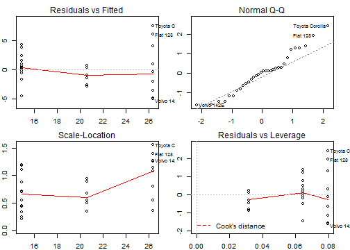

## Example plot of Residuals


```r
library(ggplot2)
data(mtcars)
fit <- lm(mpg~cyl,data=mtcars)
par(mfrow=c(2,2),mar=c(2,2,2,2))
plot(fit)
```



---

## How to customise this app to your model

To change the model in this application requires edits to just 5 location in the Shiny app. These locations are identified by the following comment prefix which can be found with a simple search.
```
# MODIFY:
```
The requires changes required are:

In ui.R
> * List of predictors
> * Text to provide a description of the model 

In server.R
> * Name of the dataset (2 locations)
> * Name of the dependant variable which is used to build the model equation
